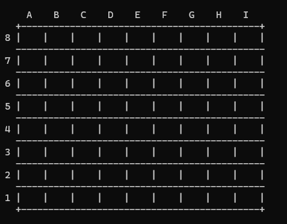

# Game of the Generals
A singleplayer Python recreation of [Game of the Generals](https://en.wikipedia.org/wiki/Game_of_the_Generals), a Filipino educational war game.

**Note:** For optimal experience, please ensure your terminal properly handles all emojis as 'wide characters' (with width 2)!

## Quick start

```bash
$ bash start.sh
```

## How to play

### Summary
You are given 21 pieces representing different combatants in an army, including one representing a **flag**. The main objective of the game is essentially to eliminate your opponent's flag by maneuvering your pieces across the board towards it.

### Setup and ranking

The game is played on a 9×8 board. The layout of your 21 pieces may be arranged however you like, as long as they are within the nearest 3 rows of the board. Alternatively, you have the option to randomise the positions of the pieces.

|                                                                               |
|:-----------------------------------------------------------------------------------------------------:|
|*The board as seen in-game. Here, coordinates are referred to in the format `XY` (for instance, `B7`).*|

All 21 pieces are arranged into different ranks. The main idea is that any higher-ranking piece may eliminate a lower-ranking piece. If both pieces are of the same rank, both are eliminated. Note that there are a few exceptions to these rules. Below is a table listing all pieces arranged from lowest to highest rank, as well as some additional notes/exceptions.

|Piece              |Note                                            |
|:-----------------:|:----------------------------------------------:|
|Flag               |Eliminates **the opposing flag** if aggressor.  |
|Private            |Eliminates the **Spy**.                         |
|Sergeant           |—                                               |
|2nd Lieutenant     |—                                               |
|1st Lieutenant     |—                                               |
|Captain            |—                                               |
|Major              |—                                               |
|Lieutenant Colonel |—                                               |
|Colonel            |—                                               |
|Brigadier General  |—                                               |
|Major General      |—                                               |
|Lieutenant General |—                                               |
|General            |—                                               |
|General of the Army|—                                               |
|Spy                |Can eliminate anyone except for the **Private**.|

### Gameplay

You are allowed to move your own pieces in the following unit directions (meaning one square every turn): up, down, left and right (assuming you are not blocked by another friendly piece or the move does not take you out of bounds). The identities of the opposing pieces are hidden, essentially simulating the fog of war. Pieces may challenge opposing pieces by (legally) occupying the position of the opponent, to which the ranking hierarchy applies.

To win the game, you must either
- capture the opponent's flag with any of your pieces (including your flag) or
- maneuver your flag to the very end of the board. At this point, if there are no adjacent pieces to your flag, you immediately win. Otherwise, all of the adjacent pieces will have to fail to immediately challenge/eliminate your flag in the next turn for you to win.

Feel free to apply your own strategies in playing this game! I can't give any sound advice in this area, sadly. I happen to be better at coding than warfare. 😭

## IMPORTANT: `termcolor`!

This program uses the `termcolor` module to display coloured and formatted text, so please ensure it's installed before running.

```bash
# MacOS/Windows
$ python3 -m pip install --upgrade termcolor

# Linux
$ sudo apt update
$ sudo apt install termcolor
```

Alternatively, you may also follow the **source installation** directions on `termcolor`'s [GitHub repository](https://github.com/termcolor/termcolor) (if you're into that).

---

> *Para kay Trish, sinta ko*
